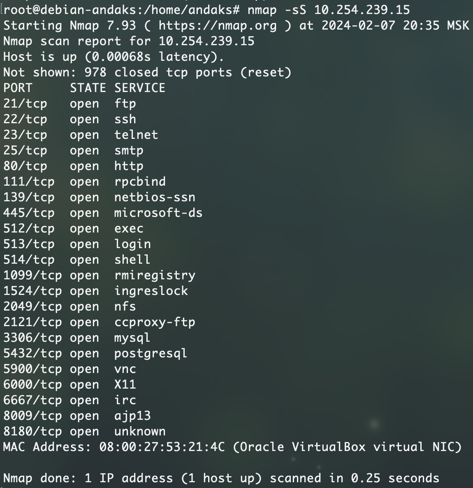
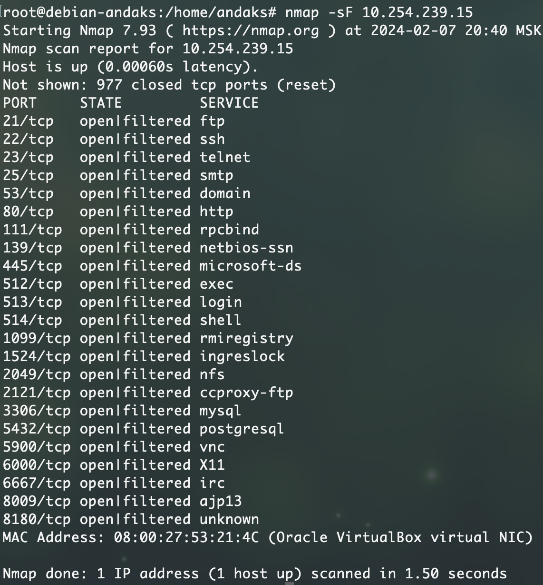
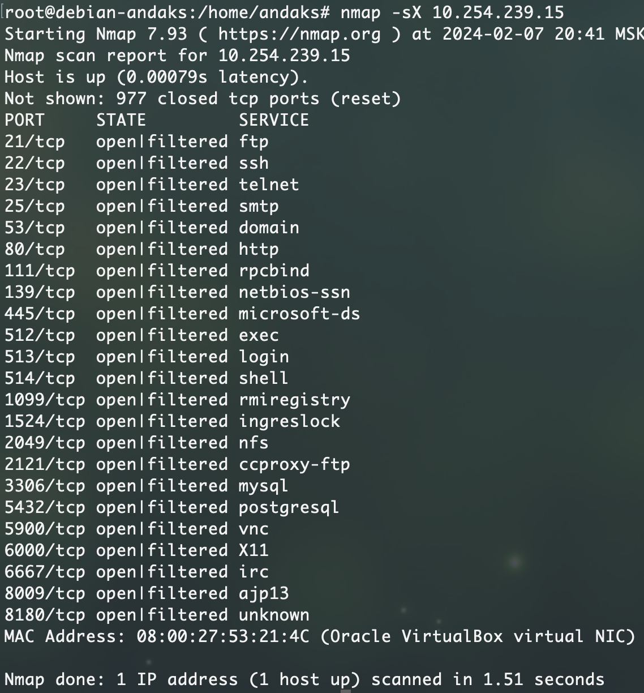

# Домашнее задание к занятию «Уязвимости и атаки на информационные системы»

------

### Задание 1

Скачайте и установите виртуальную машину Metasploitable: https://sourceforge.net/projects/metasploitable/.

Это типовая ОС для экспериментов в области информационной безопасности, с которой следует начать при анализе уязвимостей.

Просканируйте эту виртуальную машину, используя **nmap**.

Попробуйте найти уязвимости, которым подвержена эта виртуальная машина.

Сами уязвимости можно поискать на сайте https://www.exploit-db.com/.

Для этого нужно в поиске ввести название сетевой службы, обнаруженной на атакуемой машине, и выбрать подходящие по версии уязвимости.

Ответьте на следующие вопросы:

- Какие сетевые службы в ней разрешены?
- Какие уязвимости были вами обнаружены? (список со ссылками: достаточно трёх уязвимостей)
  
*Приведите ответ в свободной форме.*  

#### Ответ на задание 1.

Разрешенные на машине сетевые службы:
```BASH
root@debian-andaks:/home/andaks# nmap -sV 10.254.239.15
Starting Nmap 7.93 ( https://nmap.org ) at 2024-02-05 22:28 MSK
Nmap scan report for 10.254.239.15
Host is up (0.0012s latency).
Not shown: 978 closed tcp ports (reset)
PORT     STATE SERVICE     VERSION
21/tcp   open  ftp         vsftpd 2.3.4
22/tcp   open  ssh         OpenSSH 4.7p1 Debian 8ubuntu1 (protocol 2.0)
23/tcp   open  telnet      Linux telnetd
25/tcp   open  smtp        Postfix smtpd
80/tcp   open  http        Apache httpd 2.2.8 ((Ubuntu) DAV/2)
111/tcp  open  rpcbind     2 (RPC #100000)
139/tcp  open  netbios-ssn Samba smbd 3.X - 4.X (workgroup: WORKGROUP)
445/tcp  open  netbios-ssn Samba smbd 3.X - 4.X (workgroup: WORKGROUP)
512/tcp  open  exec        netkit-rsh rexecd
513/tcp  open  login       OpenBSD or Solaris rlogind
514/tcp  open  tcpwrapped
1099/tcp open  java-rmi    GNU Classpath grmiregistry
1524/tcp open  bindshell   Metasploitable root shell
2049/tcp open  nfs         2-4 (RPC #100003)
2121/tcp open  ftp         ProFTPD 1.3.1
3306/tcp open  mysql       MySQL 5.0.51a-3ubuntu5
5432/tcp open  postgresql  PostgreSQL DB 8.3.0 - 8.3.7
5900/tcp open  vnc         VNC (protocol 3.3)
6000/tcp open  X11         (access denied)
6667/tcp open  irc         UnrealIRCd
8009/tcp open  ajp13       Apache Jserv (Protocol v1.3)
8180/tcp open  http        Apache Tomcat/Coyote JSP engine 1.1
MAC Address: 08:00:27:53:21:4C (Oracle VirtualBox virtual NIC)
```

Уязвимости вышеобозначенных сервисов:
1. Уязвимость сервиса vsftpd. Позволяет использовать бэкдор и открыть шел в уязвимую систему.
https://nvd.nist.gov/vuln/detail/CVE-2011-2523

2.  Apache httpd 2.2.8. Скоринг высокий, но не предел. При определенных настройках и запросе, злоумышленник может получить доступ к чувствительным данным.
https://nvd.nist.gov/vuln/detail/CVE-2017-9798

3. Открыта самба уязвимой версии. Выполнение удаленного кода.
https://nvd.nist.gov/vuln/detail/CVE-2017-7494
---

### Задание 2

Проведите сканирование Metasploitable в режимах SYN, FIN, Xmas, UDP.

Запишите сеансы сканирования в Wireshark.

Ответьте на следующие вопросы:

- Чем отличаются эти режимы сканирования с точки зрения сетевого трафика?
- Как отвечает сервер?

*Приведите ответ в свободной форме.*

#### Ответ на задание 2.

Принцип сканирования режимов и их отличия:
 - sS или SYN сканирование. Полускрытый метод сканирования, при котором при построении TCP сессии на целевой хост отправляется только начальный SYN пакет.
Если порт открыт, целевой хост вернет пакет SYN-ACK, если порт закрыт, целевой хост вернет пакет RST. Если нет ответа после нескольких повторных передач, порт будет помечен как отфильтрованный. 


 - sU или сканирование UDP. UDP сканирование работает путем посылки пустого (без данных) UDP заголовка на каждый целевой порт. По закрытому порту приходит ICMP сооющение (тип 3, код 3); по фильтруемому - ICMP сообщения (тип 3, коды 1, 2, 9, 10 или 13); Иногда от открытого порта вы получите в ответ UDP пакет, иногда нет. Во втором случае придется ждать пока nmap не выполнит проверку несколько раз. Если ответ не получен, порт помечается как открытый или фильтруемый.
Есть определенные нюансы использования этого метода сканирования. Например, слишком длительный опрос ввиду нескольких попыток опроса со своими таймаутами.

*я так и не дождался окончания сканирования ввиду описанных ограничений*

 - sF или FIN сканирование. Отправляется TCP пакет с установленным флагом FIN, при получении которого сканируемый хост, согласно RFC должен отправить RST пакет для закрытых портов и ничего не отправлять для открытых.


 - sX или Xmas сканирование. Очень похож на sF, только комбинирует различные биты(FIN, PSH и URG) в запросах. На сегодняшний день считается не таким уж и скрытным сканированием.


---
